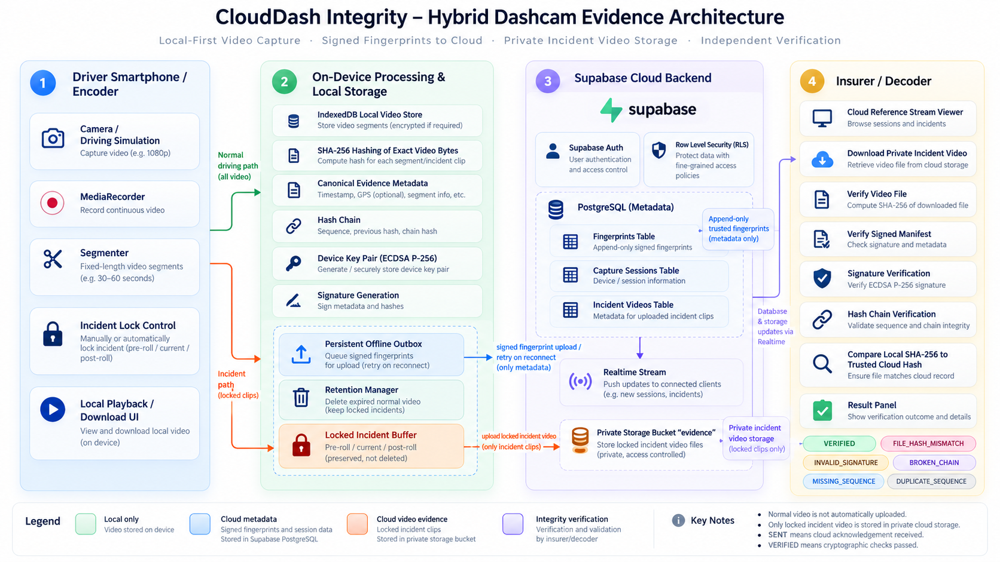

# CloudDash hybrid architecture

The green path keeps normal video on the driver's device. The blue path sends signed fingerprint/session metadata to Supabase. The orange path uploads only driver-locked incident video to private Storage. The insurer follows the purple verification path and never accepts cloud acknowledgement alone as proof of integrity.

## Encoder / driver boundary

1. `MediaRecorder` creates an original video segment.
2. The Blob and evidence metadata are persisted in IndexedDB before transmission.
3. Web Crypto computes SHA-256 over the exact Blob bytes.
4. The chain hash binds version, workspace, device, capture session, immutable segment ID, session-relative sequence, capture time, byte size, SHA-256, and previous hash.
5. A device-local ECDSA P-256 private key signs the canonical fingerprint. Only its public JWK is stored with the device.
6. The signed fingerprint is inserted into append-only Supabase PostgreSQL. Normal video remains local.

Every **Start Dashcam** action creates a new capture-session UUID. That session starts at sequence `0` with a null previous hash; subsequent segments increment only within the same session. Old cloud or queued fingerprints never seed a new session. When offline, the original signed fingerprint stays in the IndexedDB outbox. Startup, browser reconnect, and the Retry action flush it idempotently without changing its session, segment ID, sequence, hash, or signature.

## Incident path

The driver lock action protects a bounded before/current/after segment window. Locked blobs are exempt from rolling retention. After the fingerprint is acknowledged, only those locked blobs are uploaded to the private Supabase `evidence` bucket under:

`workspaceId/deviceId/incidentId/sequence.webm`

`incident_videos` links each object to its trusted fingerprint. Storage and table RLS allow the owning driver and authorized workspace analysts/admins; objects are not public and uploads cannot overwrite existing evidence.

## Decoder / insurer boundary

Local videos are hashed in the browser and never uploaded for verification. Cloud incident videos are downloaded through authenticated private Storage access. The Decoder compares the calculated hash with the trusted record, verifies the ECDSA signature using the device public key, then recomputes the ordered chain.

Possible outcomes include `VERIFIED`, `FILE_HASH_MISMATCH`, `FINGERPRINT_NOT_FOUND`, `INVALID_SIGNATURE`, `BROKEN_CHAIN`, `MISSING_SEQUENCE`, `SESSION_MISMATCH`, `DEVICE_MISMATCH`, `INVALID_MANIFEST`, `LOCAL_TAMPER_DETECTED`, `STORAGE_OBJECT_MISMATCH`, and `ERROR`. `SENT` only means Supabase acknowledged an insert; it is not a verification result. Legacy version-1 fingerprints remain review-only and are not presented as session-verified evidence.

## Trust and limits

Supabase Auth and RLS define identity and authorization. Fingerprints are insert/select only for application roles. SHA-256 proves exact byte equality against the trusted reference but cannot explain the visual edit or reconstruct deleted video.
